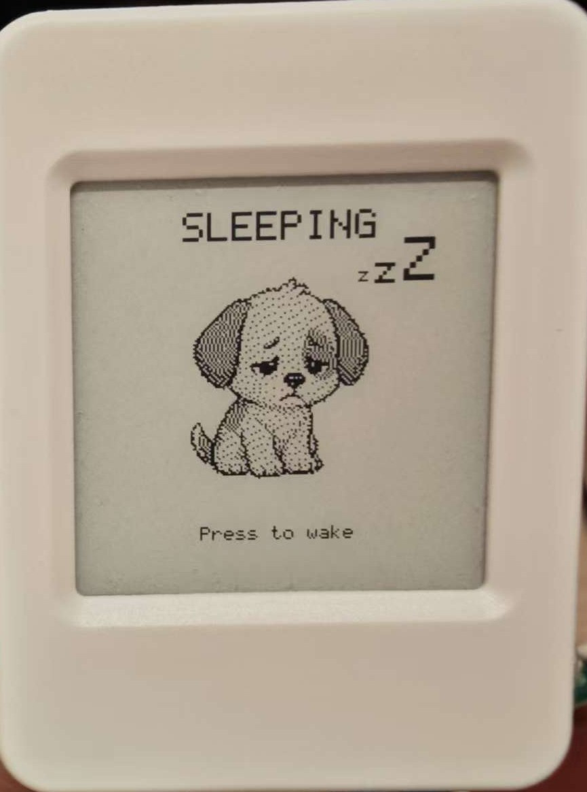

# Glane Notes — Offline-First Voice Note Recorder on ESP32-S3 + E-Paper

**🌐 Language / 语言**: **English** | [简体中文](README_CN.md)

> A pocketable "second brain" voice recorder: **press to record, release to save**.
> Capture fleeting ideas in seconds, fully offline — transcribe to text later via
> the cloud, on your terms.

**Glane Notes** is open-source [ESP-IDF](https://github.com/espressif/esp-idf)
firmware that turns a **Waveshare ESP32-S3-ePaper-1.54** board into a tiny,
distraction-free voice memo device with an e-ink display. Inspired by the
"Pala Note" project, it is designed around one idea: *capture now, process later*.

Press a button to record straight to the SD card as WAV; press again and it saves
instantly with an audible cue, then drops back into ultra-low-power deep sleep.
When you choose to sync over Wi-Fi, recordings are transcribed to searchable text
using **Aliyun DashScope (Bailian) `qwen3-asr-flash`** and written back next to
the audio. Browse, play, and export everything from an on-device list or a small
built-in web dashboard.

<!-- Keywords: ESP32-S3 voice recorder, e-paper note taker, e-ink voice memo,
ESP-IDF firmware, speech-to-text, ASR transcription, Aliyun DashScope qwen3-asr-flash,
Waveshare ESP32-S3-ePaper-1.54, SD card audio recorder, offline voice notes,
second brain device, DIY voice recorder, SSD1681 e-paper, ES8311 codec. -->

---

## 📸 Demo

<p align="center">
  
</p>

<p align="center">
  <video src="https://github.com/qinwenshi/GlaneNotes/raw/main/docs/demo_activate.mp4" height="320" controls muted playsinline></video>
</p>

The e-ink **sleep screen** shows *Buddy* — a sleepy pixel-art dog dozing under a
`zZ`. Press the button to wake the device and start recording. The clip above
shows the wake/record animation (source: [`docs/demo_activate.mp4`](docs/demo_activate.mp4)).

---

## ✨ Why Glane Notes is different

- **🔌 Offline-first capture.** Recording, the on-device note list, and speaker
  playback are **100% local**. Wi-Fi never blocks startup — out and about or with
  no network at all, the device works fully. The network is a bonus, not a
  prerequisite.
- **☁️ Deferred, on-demand transcription.** Audio stays on the SD card by default
  and is uploaded **only when you explicitly sync**. Transcription is
  **file-based (one HTTPS POST per recording)** to Aliyun DashScope
  `qwen3-asr-flash` — no WebSocket, no realtime streaming, no OpenAI Whisper
  dependency. Every note ends up as **both a playable recording and searchable
  text**.
- **📶 Zero-friction Wi-Fi setup.** A brand-new device auto-hosts a
  `GlaneNotes-Setup` access point. Join it from your phone, open `192.168.4.1`,
  and enter your Wi-Fi credentials **and** DashScope API key on one page — solving
  the classic "you need a network to configure the network" chicken-and-egg
  problem.
- **🖥️ Low-flicker e-ink UI.** Screen transitions use fast **partial refresh**; a
  single-flash full refresh runs only every 60 updates to clear ghosting. Paging
  feels almost instant on an e-paper panel.
- **🔋 Genuinely portable.** GPIO power latch, automatic deep sleep after idle,
  and an on-screen **battery indicator** (calibrated ADC) make it an everyday
  carry on a small 500 mAh LiPo.
- **🔁 Reproducible & hackable.** Pure native ESP-IDF, clean modular C++,
  one-command build/flash scripts, and committed `dependencies.lock` — fork it
  and build your own.

## 🎬 How it works

1. **Press BOOT** → recording starts (rising tone). Speak your note.
2. **Press BOOT again** → saves to `/sdcard/notes/` as 16 kHz mono WAV
   (falling tone), then returns to the low-power home screen.
3. **Press PWR** → open the on-device notes list; **BOOT** opens a note,
   **BOOT again** plays it through the speaker.
4. **Hold BOOT** → sync over Wi-Fi: each un-transcribed note is uploaded to
   DashScope and a `.txt` transcript is written back beside the audio.
5. Or open the **web dashboard** (the device's IP) to browse, play, and download
   notes and transcripts from your phone or laptop.

## 🧩 Hardware

Target board: **Waveshare ESP32-S3-ePaper-1.54** (ESP32-S3-PICO-1, dual-core
240 MHz, 8 MB flash, 8 MB PSRAM).

| Function | Detail |
|---|---|
| MCU | ESP32-S3 (Wi-Fi + Bluetooth LE) |
| Display | 1.54" SSD1681 e-paper, 200×200, partial refresh |
| Audio | ES8311 codec, I2S mic capture + speaker playback |
| Storage | microSD (SDMMC), all notes + transcripts on card |
| Power | LiPo (e.g. 500 mAh), GPIO latch, deep sleep, battery ADC |
| Input | BOOT + PWR buttons |

Full pin map: [`firmware/main/glane_config.h`](firmware/main/glane_config.h).

## 🚀 Build, flash & monitor

Requires **ESP-IDF v5.5+** and an ESP32-S3 target (developed and verified on
**ESP-IDF v5.5.2**). The convenience scripts in
[`firmware/scripts/`](firmware/scripts/) auto-source ESP-IDF and auto-detect the
serial port.

```bash
cd firmware

# Build
./scripts/build.sh              # set-target (first run) + build
./scripts/build.sh clean        # idf.py fullclean, then build
./scripts/build.sh fullclean    # rm -rf build/, then build

# Flash
./scripts/flash.sh              # build + flash (auto-detect port)
./scripts/flash.sh --monitor    # flash, then open the serial monitor
./scripts/flash.sh -p /dev/cu.usbmodemXXXX

# Monitor (Ctrl-] to quit)
./scripts/monitor.sh
```

Override the ESP-IDF location or port via env vars:

```bash
IDF_DIR=/path/to/esp-idf ./scripts/build.sh
PORT=/dev/cu.usbmodem1101 ./scripts/flash.sh
```

Or use plain `idf.py`:

```bash
source /path/to/esp-idf/export.sh
cd firmware
idf.py set-target esp32s3        # first time only
idf.py build
idf.py -p /dev/cu.usbmodemXXXX flash monitor
```

The board enumerates as a USB CDC serial device (console over USB-Serial-JTAG).
If the port disappears after the device deep-sleeps, re-check
`ls /dev/cu.usbmodem*` and pass the new port to `flash.sh -p`.

## ⚙️ First-time configuration

No Wi-Fi or API key is hard-coded — everything is stored in NVS and set from the
built-in web dashboard. On first boot (no Wi-Fi saved) the device auto-hosts a
**setup access point**:

1. Power on. The screen shows **WIFI SETUP** with an SSID and URL.
2. From your phone, join **`GlaneNotes-Setup`** (open network, no password).
3. Open **`http://192.168.4.1`** in a browser — the Settings page opens.
4. Enter your **Wi-Fi SSID + password** and **Aliyun DashScope API key**, then Save.
5. The device shows **SAVED / Restarting** and reboots onto your network.

To re-enter setup later: from the home screen **hold BOOT** to sync; if no Wi-Fi
is configured it reopens the setup AP. Press any button to cancel.

You need an [Aliyun Bailian (百炼)](https://bailian.console.aliyun.com/) API key
with access to the `qwen3-asr-flash` speech-recognition model.

> **Offline-first:** Wi-Fi never blocks startup. With credentials saved the
> device connects in the background; if it fails, recording, list, and playback
> keep working fully offline — sync simply reports *Working offline*.

## 📖 Operating guide

Two buttons (**BOOT** and **PWR**) drive a small state machine; what each press
does depends on the current screen. A **long-press** is a hold (~0.8 s); anything
shorter is a short-press.

### Home (idle)

| Action | Result |
|---|---|
| **Short-press BOOT** | Start recording (rising tone). Press again to stop & save. |
| **Long-press BOOT** | Sync over Wi-Fi (transcribe all un-transcribed notes) |
| **Short-press PWR** | Open the on-device notes list |
| **Long-press PWR** | Enter deep sleep immediately |
| Idle ~3 min | Auto deep sleep; press BOOT to wake |

The home screen shows a **battery indicator** (icon + %) top-left, the note count,
and Wi-Fi status (and the device IP once connected).

### Recording

| Action | Result |
|---|---|
| **Press BOOT or PWR** | Stop and save the recording (falling tone) |

Recordings are 16 kHz mono WAV, hard-capped at **10 minutes** per file. A live
timer is shown via fast partial refresh. The stop is non-blocking — the SD write
finalizes in the background so the UI returns home immediately.

### Notes list

| Action | Result |
|---|---|
| **Short-press PWR** | Move the selection cursor down (wraps to top) |
| **Short-press BOOT** | Open the selected note's detail screen |
| **Long-press BOOT** | Back to the home screen |
| **Long-press PWR** | Deep sleep |

Notes are shown newest-first. Each row shows its number and — once the clock has
been set over Wi-Fi (SNTP) — the recording date/time (`MM-DD HH:MM`); before the
first sync it shows `--:--`.

### Note detail

| Action | Result |
|---|---|
| **Short-press BOOT** | Play the recording through the speaker |
| **Short-press PWR** | Back to the notes list |
| **Long-press BOOT** | Back to the home screen |

### Playing

| Action | Result |
|---|---|
| **Press BOOT or PWR** | Stop playback |
| (playback finishes) | Returns automatically to the detail screen |

### 🖥️ Web dashboard

When connected to Wi-Fi the device serves a dashboard at its IP address:

| Route | Purpose |
|---|---|
| `/` | List notes with size & transcript status |
| `/note?id=...` | View a transcript |
| `/dl?id=...` | Download the WAV |
| `/del?id=...` | Delete a note (and its transcript) |
| `/settings` | Set Wi-Fi credentials & DashScope API key |
| `/sync` | Request a sync (returns immediately; runs when idle) |

The e-ink screen shows English status only; Chinese (or any) transcripts are
viewable in the web dashboard and the `.txt` files on the SD card.

### 🗃️ SD card layout

```
/sdcard/notes/
├── note-0000000001.wav            # recording (16 kHz mono)
├── note-0000000001.txt            # transcript (written after sync)
└── note-0000000001.wav.diag.txt   # capture diagnostics
```

To read recordings or diagnostics on a computer, eject the card from the device
and mount it on your Mac/PC. The device shows **SD mount fail** while the card is
removed.

## 🛠️ Troubleshooting

| Symptom | Likely cause / fix |
|---|---|
| **SD mount fail** on boot | Card not seated (or it's in your computer). Re-insert and reboot. |
| **Recording plays back silent** | Check the serial log for `ES8311 init OK`; inspect the note's `.diag.txt` (near-zero AC RMS = no mic data). |
| **Recording sounds sped-up** | Open the note's `.diag.txt`: `i2s_read_rate` should be ≈ 48000 and `ratio` ≈ 1.0. |
| **Length shorter than the timer** | Check `ring_drops` (want 0) and `i2s_read_rate` ≈ 48000 in `.diag.txt`. |
| **Sync says "Working offline"** | Wi-Fi not connected; check credentials in `/settings`. Recording/list/playback still work. |
| **Empty transcript after sync** | DashScope auth/quota, or file > 3 MB inline cap (~90 s). Check the API key & length. |
| **Serial port disappears** | Board slept and re-enumerated USB. Re-check `ls /dev/cu.usbmodem*`. |

See [`firmware/README.md`](firmware/README.md) for the deep technical
documentation: hardware pin map, the DashScope request format, the capture/DSP
pipeline, the diagnostic sidecar fields, and the full module map.

## 🗂️ Project structure

```
firmware/
├── main/            # application: recorder, player, UI, sync, web, wifi, battery…
├── components/      # epaper_bsp (SSD1681 driver)
├── scripts/         # build / flash / monitor helpers
└── README.md        # detailed firmware documentation
```

## 🛣️ Roadmap ideas

- Tag menu after recording (project / todo / idea)
- Automatic once-per-day background sync
- Tag filtering & full-text search in the web dashboard
- On-device note summaries / titles via the existing AI connection

## 📄 License & credits

Built with [ESP-IDF](https://github.com/espressif/esp-idf). E-paper, codec, and
button drivers are adapted from the `ESP32-S3-EPaper-Player` reference project for
the same board. Concept inspired by the "Pala Note" pocket voice recorder.

Contributions, forks, and feature ideas are welcome.
